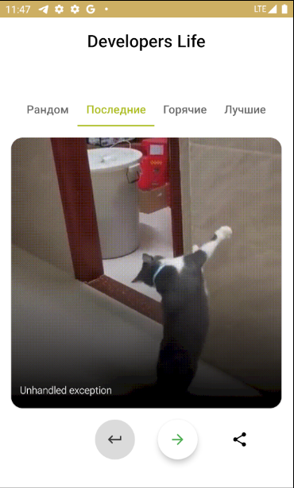
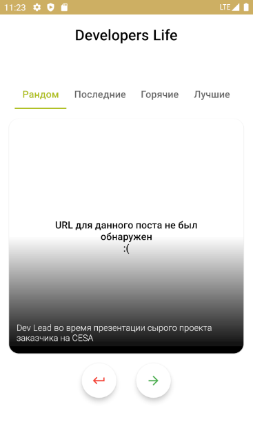

# PyavkinTestApp

Тестовое приложение для отображения gif-картинок с сайта https://developerslife.ru/

Внешний вид приложения: 
Был добавлен функционал шаринга гифок 
  

У некоторых постов отсутствовало поле "gifURL" 
Данный кейс был обработан следующим образом: 

